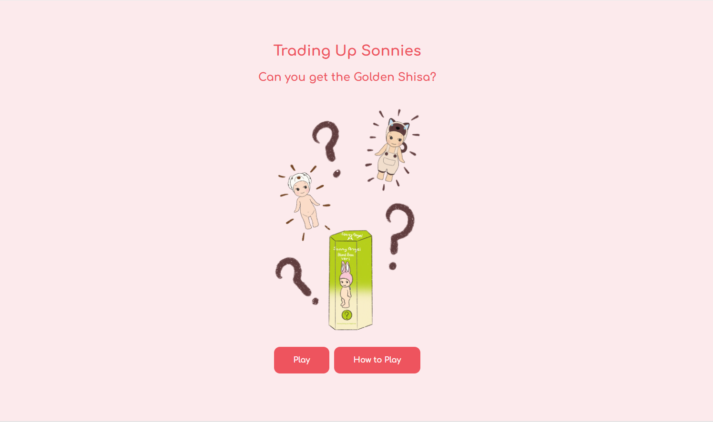

# Trading Up Sonnies

Sonny Angel is a little cherub boy, wearing different kinds of headgear. This collection of figurines was created by Dreams founder Toru Soeya in 2004 and was designed as a companion to working women in their 20s dealing with stress.

**“He may bring you happiness.”**

A feature of Sonny Angels is that each one comes in a blind box; you won’t know which figure in a series you’ll get until you open the box. There is a certain excitement and thrill in guessing which one you’ll get, and communities have been built around this doll to trade your duplicates or for something else.

**Trading Up Sonnies - The Game**

I received my first Sonny Angel as a gift and didn’t get what I liked. My friend introduced me to the Sonny Angel Singapore community, and I decided to try my hand at trading my only Sonny Angel for something closer to what I wanted. I’ve done two trades since then and will be holding on to my current Sonny until another suitable trade comes along.

To share my love for Sonnies, I’ve coded this buying and trading game in the form of choose-your-own-adventure, hoping to re-ignite the fun of trading just for the heck of it!!

In this game, you have to grow your Sonny collection by choosing options that will trigger buy or trade events. Build an impressive collection and try to trade for the rare Golden Shisa at the end.

## Getting Started

Play the game [here](https://uncommonlibrary.github.io/tradingupsonnies/).

Cycle through different options with each click! Certain events have different probabilities of happening, and trade options and blind box results are randomised each time.

Every Sonny has a certain market value. Make the right trades or get lucky to increase your collection’s value.

See how I planned this game [here](https://miro.com/app/board/uXjVKyOmHVw=/?share_link_id=411556532347).

## Attributions & Credits

- Sonny Angel - I do not own Sonny Angels. This is a fan-made game in fulfillment of my coding bootcamp project.

## Technologies Used

HTML, CSS, JavaScript, and Procreate.

## Next Steps

- Condensing the code of certain functions.

- Expand the Sonny Angel database and include more categorisations.

- Include a game rule where trades will only be accepted if the player’s Sonny to be traded is within a certain range of the selected Sonny they want.

- Expand the number of events and include random events.

- Improve the writing of game events; build a story.

- Include more player-character interaction.

- Cozy audio track to play in the background.
